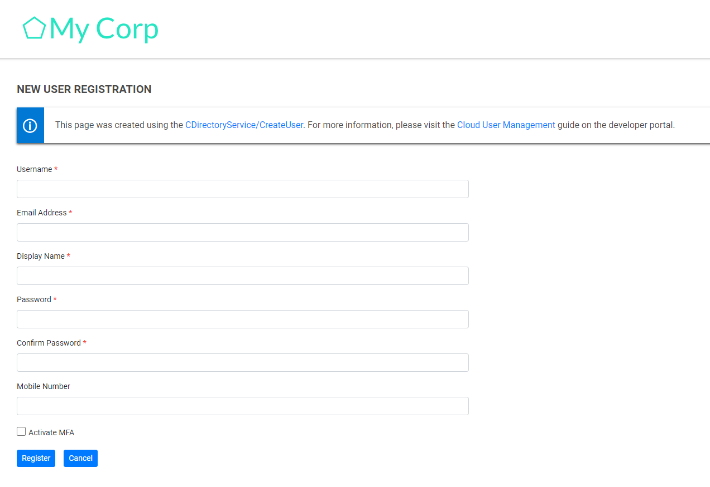
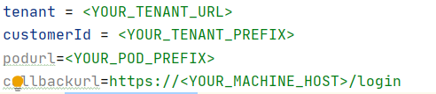

# idaptive-api-demo
Sample web application to demonstrate the usage of the Idaptive public RESTFul APIs.

# Contents
<!-- MarkdownTOC -->

- [Demo Web App Documentation](#demo-web-app-documentation)
    - [Prerequisites to understand web application](#prerequisites-to-understand-web-application)
    - [Integration Steps with CyberArk Identity Server](#integration-steps-with-cyberark-identity-server)
        - [Setup an OAuth Client Web Application using Client Credentials flow](#setup-an-oauth-client-web-application-using-client-credentials-flow)
    - [Web App Features](#web-app-features)
        - [Login User](#login-user)
        - [Sign Up / Register User](#sign-up--register-user)
        - [Update User Info](#update-user-info)
    - [Configuration Files Setup](#configuration-files-setup)
    - [Web App Deployment Steps](#web-app-deployment-steps)
        - [Install GIT on windows:](#install-git-on-windows)
        - [Install Docker on Windows 10](#install-docker-on-windows-10)
        - [Install Docker on Windows Server\(TBD\)](#install-docker-on-windows-servertbd)
        - [Generate SSL certificate](#generate-ssl-certificate)
        - [DNS Aliasing](#dns-aliasing)
        - [Build Maven Project](#build-maven-project)
        - [Build Angular project](#build-angular-project)
        - [Docker Composer Changes](#docker-composer-changes)
        - [Start Services](#start-services)
    - [Change tenant details](#change-tenant-details)
    - [Project Services Overview](#project-services-overview)
- [License](#license)

<!-- /MarkdownTOC -->


<a id="demo-web-app-documentation"></a>
# Demo Web App Documentation

<a id="prerequisites-to-understand-web-application"></a>
## Prerequisites to understand web application

- Java Spring boot
- Docker
- SSL

<a id="integration-steps-with-cyberark-identity-server"></a>
## Integration Steps with CyberArk Identity Server

- Add a **Role** named **MFA** in the admin portal and give **User Management, Role Management Rights.** Map this role to a policy and enable the MFA for identity portal login in the policy.
    > Link for further reference [Role Creation](https://docs.cyberark.com/Product-Doc/OnlineHelp/Idaptive/Latest/en/Content/CoreServices/GetStarted/RolesAdd.htm)
- To update the user / role, **User Management, Role Management Rights** are required.

<a id="setup-an-oauth-client-web-application-using-client-credentials-flow"></a>
### Setup an OAuth Client Web Application using Client Credentials flow

1. [Create a new OAuth 2.0 Client Web App](https://identity-developer.cyberark.com/docs/client-credentials-flow#step-1-create-a-new-oauth-app-in-the-admin-portal)
2. [Configure OAuth 2.0 Client](https://identity-developer.cyberark.com/docs/client-credentials-flow#step-2-configure-the-new-oauth-20-client).
- Select Client ID Type as **Confidential** and **Must be OAuth Client**  
    - 
- Select **Client Creds** as Auth Method. Also, select **JwtRS256** as Token type.
    - 
1. [Create Scope](https://identity-developer.cyberark.com/docs/client-credentials-flow#step-3-create-scopes)
2. [Create a Confidential Client](https://identity-developer.cyberark.com/docs/client-credentials-flow#step-4-create-a-confidential-client)
3. Create a **Role** and give **User Management, Role Management Rights.**
    - To update the user / role we require **User Management, Role
    Management Rights.**
    - Add newly created Confidential Client to the Role.
4. Setup Permissions for OAuth 2.0 Client.
    - Add newly created role and give **Run Access** to generate **Bearer Token.**
    - Enter the Client ID and client secret.
        - Client Id – **Confidential Client Username**
        - Client Secret – **Password of the user**
5. In case we need to configure social login, configure it through Redirect URI as demo web app URL (<https://apidemo.idaptive.app:443/login>) to login using **Social Login. Link to [Configure Social App](https://docs-staging.conjur.org/Idaptive/Dev/en/Content/CoreServices/UsersRoles/SocialMedCustomBrand.htm).**
    

<a id="web-app-features"></a>
## Web App Features

<a id="login-user"></a>
### Login User
- User can login using Social Login
- If MFA is activated, User can login using MFA. Supported MFA are User Password, Email Verification, Security Question, SMS Verification.

  

<a id="sign-up--register-user"></a>
### Sign Up / Register User

- **Activate MFA** **checkbox** indicates that user will be mapped to the role **MFA** which we created initially so that policy will be assigned for newly created user.
- As we have mapped this role (**MFA**) to the policy, MFA will be activated.
- To update the user / role we require **User Management, Role Management Rights**.

  

<a id="update-user-info"></a>
### Update User Info

We can update user Information after successful login.


These are the features available in the web app.

<a id="configuration-files-setup"></a>
## Configuration Files Setup

- Set config for every file under this folder (..\\idaptive-api-demo-master\\config-data)
- Give values for the place holders in **auth-service.properties** file.
    -   
- Example for **auth-service.properties** file
    -   
- Give values for the place holders in **user-ops-service.properties** file.
- Give values for the place holders in **user-service.properties** file.
    -   
    -   Tenant: Idaptive Tenant URL
    -   Scope: OAuth Client Scope name
    -   OAuthAppId: OAuth Client Application Id.
    -   OAuthUser: Client Id – Confidential Client Username
    -   OAuthPassword: Client Secret – Confidential Client Password
-   Example for **user-ops-service.properties** file
    -   

<a id="web-app-deployment-steps"></a>
## Web App Deployment Steps

<a id="install-git-on-windows"></a>
### Install GIT on windows:

-   Download and install GIT on windows <https://git-scm.com/download/win>
-   Create a folder in C drive I.e., C:/identity-demowebapp
-   Open git bash and navigate to the folder created
-   Run the command git init to initialize the repository.
-   Navigate to [https://github.com/idaptive/idaptive-api-demo](https://github.com/idaptive/idaptive-api-demo) and click on code. 
-   Copy the HTTPS URL.
    -   
-   Run the command git pull &lt;repository\_https\_url&gt;
-   The code gets pulled in the repository
-   To pull the latest changes navigate to folder in git bash “C:/identity-demowebapp” and do a git pull

Alternatively, you can,
-   Download the source code from git
    -   <https://github.com/idaptive/idaptive-api-demo>

<a id="install-docker-on-windows-10"></a>
### Install Docker on Windows 10

-   Install Docker Desktop
    - <https://hub.docker.com/editions/community/docker-ce-desktop-windows>
-   Go to Settings in **Docker Desktop** and Enable ***Expose daemon on tcp://localhost:2375 without TLS*** checkbox.

<a id="install-docker-on-windows-servertbd"></a>
### Install Docker on Windows Server(TBD)

-   To install docker on Windows server, start a PowerShell-window as administrator and run the following commands:
    ```powershell
    > Install-Module -Name DockerMsftProvider –Force

    > Install-Package -Name docker -ProviderName DockerMsftProvider -Force

    > Restart-Computer -Force
    ```
-   Set environment variable 
    -   DOCKER\_HOST=tcp://localhost:2375
-   Run docker version command to check if docker is available
-   Install maven
    -   https://www.javatpoint.com/how-to-install-maven
-   Install jdk
    -   <https://www.oracle.com/java/technologies/javase-jdk15-downloads.html>

<a id="generate-ssl-certificate"></a>
### Generate SSL certificate

-   Download and Install openssl
    -   <https://sourceforge.net/projects/openssl/files/openssl-1.0.2j-fips-x86_64/openssl-1.0.2j-fips-x86_64.zip/download>
-   Set environment variable
    -   OPENSSL\_CONF=C:\\ProgramFiles\\OpenSSL\\bin\\openssl.cnf
-   Create domains.ext file in the desktop folder and add this below content to the file.
    ```
    authorityKeyIdentifier=keyid,issuer
    basicConstraints=CA:FALSE
    keyUsage = digitalSignature, nonRepudiation, keyEncipherment,
    dataEncipherment
    subjectAltName = @alt\_names
    \[alt\_names\]
    DNS.1 = localhost
    DNS.2 = apidemo.idaptive.app
    DNS.3 = discovery
    ```
-   Open **openssl** terminal as administrator (C:\\ProgramFiles\\OpenSSL-Win64\\bin\\openssl.exe) and Run the following commands
    ```
    -   req -x509 -nodes -new -sha256 -days 1024 -newkey rsa:2048 -keyout
        RootCA.key -out RootCA.pem -subj "/C=US/CN=apidemo.idaptive.app"

    -   x509 -outform pem -in RootCA.pem -out RootCA.crt

    -   req -new -nodes -newkey rsa:2048 -keyout localhost.key -out
        localhost.csr -subj
        "/C=US/ST=YourState/L=YourCity/O=Example-Certificates/CN=localhost.local"
    ```

> Make sure you change the file path for -extfile

    ```
    -   x509 -req -sha256 -days 1024 -in localhost.csr -CA RootCA.pem -CAkey
        RootCA.key -CAcreateserial -extfile
        "C:\\Users\\DEV\\Desktop\\domains.ext" -out localhost.crt
    -   pkcs12 -export -out sslkeystore.p12 -inkey localhost.key -in
        localhost.crt -name demowebapp -password pass:testTEST1234
    ```
-   Copy the **sslkeystore.p12** (C:\\Program Files\\OpenSSL\\bin\\sslkeystore.p12) file and place it under resources folder (..\\idaptive-api-demo-master\\zuul-server\\src\\main\\resources)
-   Now update the ssl config in **application.yml** file (..\\idaptive-api-demo-master\\zuul-server\\src\\main\\resources\\application.yml)
    ```
    key-alias: demowebapp
    key-store-type: pkcs12
    key-password: testTEST1234
    key-store-password: testTEST1234
    key-store: classpath:sslkeystore.p12
    ```
-   Import certificate to the store by right click on sslkeystore.p12 file to install pfx.
-   The following certs should be installed on the sandbox: (Navigate to
    C:\\Program Files\\OpenSSL\\bin)
    -   Root CA cert: This cert should be installed for the local
        computer in trusted root certificates store.
        -   Double click the cert and click on Install certificate.
            -   
        -   Select “Local Machine”
            -   
        -   Select trusted certificates store.
            -   
        -   Click on next to install the certificate.
-   Similarly install the localhost certificate. This certificate should be installed on the local computer in personal store.

<a id="dns-aliasing"></a>
### DNS Aliasing

-   Make a host entry in hosts file (C:\\Windows\\System32\\drivers\\etc\\hosts)
    ```
    127.0.0.1 apidemo.idaptive.app
    ```

<a id="build-maven-project"></a>
### Build Maven Project

-   Perform maven build at project level (..\\idaptive-api-demo) to
    build each project.
    ```
    mvn clean install
    ```
-   This will generate docker images for each service.

<a id="build-angular-project"></a>
### Build Angular project

-   Open **command prompt**, navigate to this path (..\\idaptive-api-demo\\angular) and run build command.
    ```
    ng build –prod
    ```
-   Run command to generate docker image for angular project (..\\idaptive-api-demo\\angular)
    ```
    docker build -t api-demo:v4.1 .
    ```

<a id="docker-composer-changes"></a>
### Docker Composer Changes

-   Make changes to docker-composer.yaml to include the appropriate ports
    -   
    -   


<a id="start-services"></a>
### Start Services

-   To start the services, navigate to folder **Config-Data** (..\\idaptive-api-demo\\config-data) through command line and run “**docker-compose up**”. 
    ```
    docker-compose up
    ```
-   This should start all the docker containers.
-   Now we can access our web application using this URL <https://apidemo.idaptive.app>

<a id="change-tenant-details"></a>
## Change tenant details

-   If we want to change the tenant details navigate to **Config-Data** (...\\idaptive-api-demo\\config-data) through command line and run “**docker-compose down”**.
    ```
    docker-compose down
    ```
-   This should stop all the docker containers.
-   Navigate to C:\\idaptive-api-demo-master\\config-data and modify the config and properties files accordingly as described in **Configuration Files Setup**
-   Perform maven build at project level (...\\idaptive- api -demo) to build each project.
    ```
    mvn clean install
    ```
-   Again, navigate to **Config-Data** (...\\idaptive-api-demo\\config-data) and run “**docker-compose up**” to start all the docker containers
    ```
    docker-compose up
    ```

<a id="project-services-overview"></a>
## Project Services Overview

-   **Authentication Service –** It deals with user authentication and social login flow.
-   **User Operations –** It deals with user update, role update, interacting with OAuth Client to get bearer token.
-   **User Registration –** It deals with create user, interacting with OAuth Client to get bearer token.
-   **Discovery –** Used as a registry for all services so that all service locations are accessible from one single service. (
    https://spring.io/guides/gs/service-registration-and-discovery/)
-   **Zuul-server –** For routing and filtering of services.
    (https://spring.io/guides/gs/routing-and-filtering/)
-   **Config-server –** Used for managing configurations.
    (https://cloud.spring.io/spring-cloud-config/reference/html/)

<a id="license"></a>
# License

This project is licensed under MIT - see [`LICENSE`](LICENSE) for more details.
